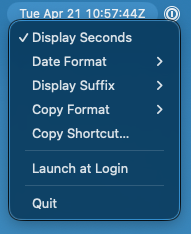

# ZuluBar

Lightweight UTC clock for the macOS menu bar with one-click copy and customizable formats.

## Get ZuluBar

- **[Get the signed build](https://zulubar.app)** — Signed, notarized, with auto-updates ($5)
- **[Build from source (free)](#development)** — Unsigned, no auto-updates
- **[Releases / changelog](https://github.com/tra0x/zulubar/releases)**

## Usage



- **Left-click** → Copy UTC time to clipboard
- **Right-click** → Settings menu

Display options:

- Toggle seconds on/off
- Suffix: `14:23:45Z` or `14:23:45 UTC` or `14:23:45`
- Date prefix: none, `Tue Dec 2 14:23:45 UTC`, or `Tue 2 Dec 14:23:45 UTC`

Copy formats:

- Display: `14:23:45Z`
- Unix Timestamp: `1733150625`
- RFC 3339: `2025-12-02T14:23:45Z`

## Free vs. Paid

ZuluBar is 100% open source (MIT). You can build it yourself for free with full functionality.

The paid version adds:

- Code-signed and notarized — no Gatekeeper warnings
- Automatic updates
- Supports continued development

## Development

Requires macOS 14.0+ and Xcode 16.0+. Open `ZuluBar.xcodeproj` and run (⌘R).

Architecture: `AppDelegate` owns the menu bar lifecycle and delegates to focused modules: `Settings` for preferences, `StatusBarRenderer` for title composition, `HotKeyManager` for global hotkey registration, and `TimeFormatter` for pure formatting.

**Run tests:** ⌘U in Xcode or:

```bash
xcodebuild test \
  -project ZuluBar.xcodeproj \
  -scheme ZuluBar \
  -configuration Debug-Free \
  -derivedDataPath ./build/DerivedDataLocal \
  CODE_SIGNING_ALLOWED=NO
```

Build configurations:

- `Debug-Free` / `Release-Free` (unsigned)
- `Debug-Paid` / `Release-Paid` (signed)

Common commands:

```bash
# Free (unsigned)
make run           # build and launch (quickest)
make build-free
make build-free-release
make zip-free

# Paid (signed)
make build-paid
make build-paid-release
make zip
```

## Contributing

Pull requests welcome. See [CONTRIBUTING.md](CONTRIBUTING.md).

## License

MIT - see [LICENSE](LICENSE)
